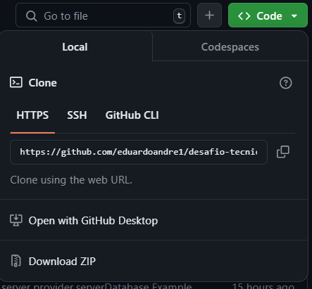
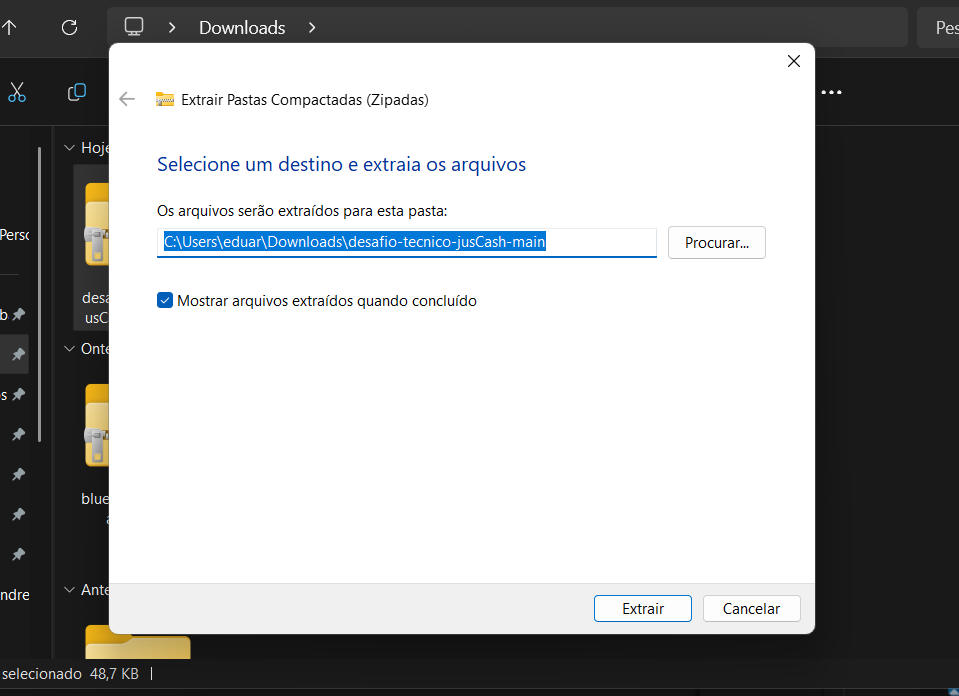

# Desafio JusCash

## Sumário
- Guia de instalação
- Guia de Deploy
- Processos explicados por página
- extras: 
- pagina extra
- responsividade Mobile  
___ 
## Guia de instalação
- vá e em : 

https://github.com/eduardoandre1/desafio-tecnico-jusCash


click no botão verde escrito : ' <>code ' depois em Dowload ZIP


Vá no arquivo e clicke com o segundo botão e escolha extrair tudo 


escolha o local que deseja salvar 


tendo o arquivo montado clicke com o segond botão e escolha a opção abrir no terminal


no terminal digite os seguintes condigo  
```js
  npm install
```
resultara numa imagem como esta: 


pronto seu arquivo foi montado agora para executar basta digitar :
```js
  npm run dev
```
resultara numa saida igual a esta:


- se a pagina não abrir automaticamente no seu seu naveagador 
va na saida local: Local:   http://localhost:5173/ e segurando Ctrl clicke no link do terminal

## Deploy 


no github basta clickar na região about e cliclar no link: desafio-tecnico-jus-cash.vercel.app


## Processos explicados por página

Antes de de esplicar os processo feito por página como o projeto não possuia back-end para eu simular e controlar o projeto para que se possa ter a sensação e dados de um Banco de dados eu criei um arquivo chamado: `serverDatabase.tsx` simulando o que teria no banco de dados 
e tambem usei o Hook do react UseContext(para salvar as modificações no banco de dados)
```javascript	
  import { createContext } from "react";
import LeadType from "./types/Lead.type";

export interface ServerType 
{
	email: string;
	setEmail: (value: string) => void;
	password: string;
	setPassword: (value: string) => void;
	name: string;
	setName: (value: string) => void;
	Leads:LeadType[];
}
const ServerPovider = createContext(<ServerType>({}))
 
export default ServerPovider
```

### página 'Resgister'

 foi aplicada a regra de negócios e caso o cliente cometa algum erro será lembrado com uma mensaguem neste estilo
 
para validar a regra `deve possuir ao menos 8 caracteres, contendo ao menos, um caracter especial, um caracter numérico, um caracter alfanumérico`

```js
  const regex = /^(?=.*[a-zA-Z])(?=.*\d)(?=.*[\W_]).{8,}$/
  regex.test() // true aceita as regras / false esta faltando algo 
```

a pagina salva as senhas no provider o que simularia enviar para o banco de dados
### página 'Login'

só simular a resposta do banco de dados 
basta repetir os valores colocados 

### página 'Leads

antes de tudo assumi que o formato json do banco de dados das Leads foi 
```js
export default interface LeadType {
	name: string,
	email: string,
	tel: string,
	todos: boolean,
	tipo: 'Cliente Potencial' | 'Dados Confirmados' | 'Analise de Lead',//limitei de forma controla já que este dadós só pende vim neste formato
	honoráriosSucumbenciais: boolean,
	honoráriosContratuais: boolean,
	honoráriosDativos: boolean,
	CreditoDoAutor: boolean
}

/// a tipagem deste objeto foi feita para poder criar a mudança de valores entre colunas limintando os valores para não crash a página
export interface typesLead 
{
	type: 'Cliente Potencial' | 'Dados Confirmados' | 'Analise de Lead'
}
```
## Pagina extra só algo que eu quiz fazer 
## Posponsivideade mobile
- formatei a pagina para que possa ser lida por celular
 


